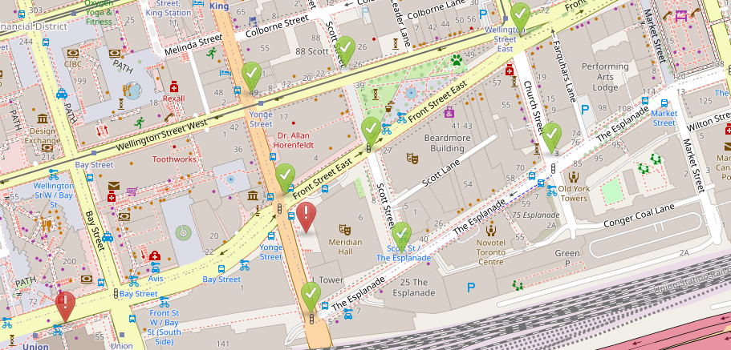

# Toronto Traffic Digital Twin

A calibrated microscopic traffic digital twin of a downtown Toronto study area, built with Eclipse SUMO and real Turning Movement Count (TMC) data from the City of Toronto.



## Documentation

- [Build guide](sumo-digital-twin-build-guide.md) - background, setup notes, and the original InTAS-to-Toronto workflow.
- [Results report](Report.md) - calibration results, validation results, limitations, and interpretation.

## Project Overview

| Item | Value |
| --- | --- |
| Study area | Downtown Toronto: Financial District / St. Lawrence |
| Simulation tool | Eclipse SUMO 1.27 |
| Real data | City of Toronto TMC counts from 2020 |
| Calibration day | 2020-01-16 |
| Validation day | 2020-01-25 |
| Primary metric | GEH statistic |

## Key Results

The primary evaluation uses internal, well-connected approaches. Boundary approaches are reported separately because the upstream junctions fall outside the extracted network.

| Metric | Calibration | Validation |
| --- | ---: | ---: |
| Average GEH | **2.87** | **8.69** |
| Intervals with GEH < 5 | **70.8%** | **56.2%** |
| Intervals with GEH < 10 | 99.0% | 65.6% |

The model calibrates well on the core approaches. Validation is moderate, with the largest residual error on the south approach. The reasons and exclusions are documented in the [results report](Report.md).

## Repository Structure

```text
traffic-digital-twin/
├── README.md                         # Project entry point
├── Report.md                         # Results and limitations
├── sumo-digital-twin-build-guide.md  # Detailed workflow and references
├── pyproject.toml                    # Python project metadata and dependencies
├── calibration/                      # Shared analysis directory
├── src/traffic_digital_twin/         # Python package
└── toronto/
    ├── toronto_cal.sumocfg           # Calibration configuration
    ├── toronto_val.sumocfg           # Validation configuration
    ├── calibrate_demand.py           # Demand multiplier calibration
    ├── diagnose_internal.py          # Internal-approach GEH analysis
    ├── demand/
    │   ├── flows_cal.xml             # Calibration flow definitions
    │   ├── flows_val.xml             # Validation flow definitions
    │   ├── toronto_cal.rou.xml       # Routed calibration vehicles
    │   ├── toronto_val.rou.xml       # Routed validation vehicles
    │   ├── tmc_cal_2020-01-16.csv    # Calibration TMC data
    │   └── tmc_val_2020-01-25.csv    # Validation TMC data
    ├── detectors/
    │   └── detectors.add.xml         # Induction-loop detector definitions
    ├── network/
    │   └── osm.net.xml               # SUMO network
    └── results/                      # Detector output and GEH summaries
```

## Requirements

- Windows, macOS, or Linux
- Python 3.13 or newer, as specified in [pyproject.toml](pyproject.toml)
- Eclipse SUMO 1.27.1 or newer with `sumo` and `jtrrouter` available on `PATH`
- Python dependencies declared in [pyproject.toml](pyproject.toml)

Install the project environment with `uv`:

```bash
uv sync
```

Alternatively, install the declared dependencies with your preferred Python environment manager.

## Running the Model

Run commands from the `toronto/` directory because the SUMO configuration files use paths relative to that directory.

### Calibration simulation

```bash
cd toronto
sumo -c toronto_cal.sumocfg
python diagnose_internal.py
```

The demand multiplier experiment is available as:

```bash
cd toronto
python calibrate_demand.py
```

It writes the demand calibration summary to `toronto/results/calibration_demand.csv` and restores the original calibration flows when it finishes.

### Validation simulation

```bash
cd toronto
sumo -c toronto_val.sumocfg
```

The current `diagnose_internal.py` reads the calibration TMC file by design. To calculate validation metrics, use the same analysis pattern with `toronto/demand/tmc_val_2020-01-25.csv` as the observed input, or extend the script with an input-file argument.

## Methodology

1. Extract and clean the Toronto road network from OpenStreetMap.
2. Convert TMC turning counts into SUMO flow definitions.
3. Route the flows through the network with `jtrrouter`.
4. Compare detector counts with observed 15-minute TMC counts.
5. Evaluate demand using the GEH statistic and inspect internal and boundary approaches separately.
6. Validate the calibrated demand on an independent day without further parameter changes.

## Limitations and Next Steps

- Four peripheral approaches are affected by missing upstream network connectivity.
- The calibration uses turning ratios from a single day, so day-to-day demand variation remains.
- The denser calibration day produces teleports that indicate residual congestion or lane-change issues.
- Future work should expand the network boundary, add time-varying turning ratios, calibrate driver behavior, and validate across more days.

See the [results report](Report.md) for the full discussion.

## License and Data

This project is released for educational and research purposes. City of Toronto TMC data remains subject to the City's open-data license.